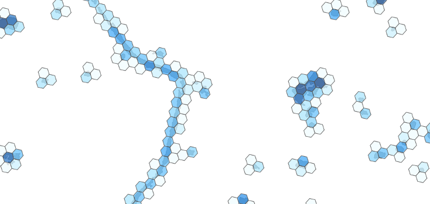

# [PostgreSQL](https://www.postgresql.org) extension for the [H3](https://uber.github.io/h3) hierarchical geospatial indexing system

This extension integrates with the [PostGIS](https://postgis.net/) geometry type. Namely `Point`, `Polygon` and `MultiPolygon` geometries are supported.

To see the functions implemented in this extension please refer to the [SQL API](doc/pgh3.md).

## Installation

__Compile H3 as a shared library__. The source is available on [github](https://github.com/uber/h3), there are also detailed instructions for building H3 available in that repository, but to make H3 work with this extension there are are two addtiional build flags required:

    cmake -DBUILD_SHARED_LIBS=1 -DCMAKE_INSTALL_PREFIX:PATH=/usr
    make
    sudo make install

In case you have set up your `LD_LIBRARY_PATH` for PostgreSQL to also look in `/usr/local` for libraries, you can ommit the `-DCMAKE_INSTALL_PREFIX:PATH=/usr` switch.

__Compile the pgh3 extension__:

    make
    sudo make install

__Run the tests__ (this is an optional step):

    make installcheck

## Usage

Before using this extension, it needs to be added to the databses using postgresqls [CREATE EXTENSION](https://www.postgresql.org/docs/current/static/sql-createextension.html) command:

    create extension postgis; -- dependency of pgh3, must be created first
    create extension pgh3;

For usage examples see the unittests in the `sql/*_test.sql` files.

## TODO

* Implement more parts of the H3 API
* Use the `numeric`-type for H3 indexes?
